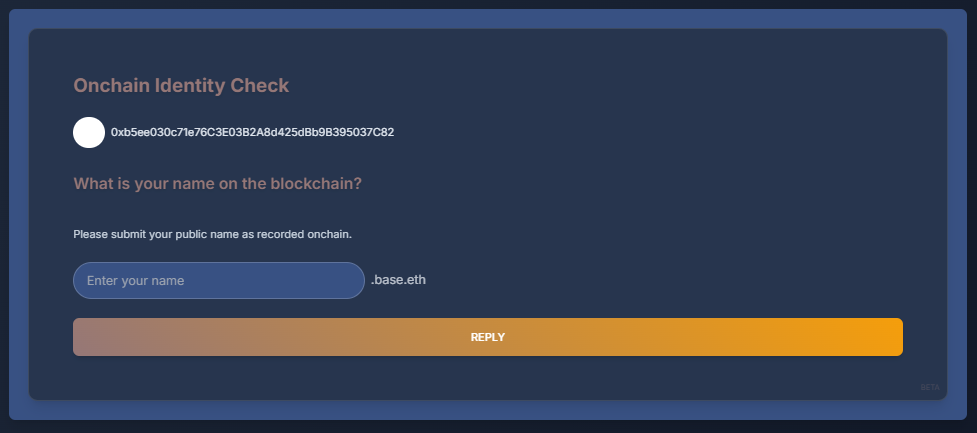

# Mission Enrollment

**An enrollment tool for a collaborative artistic mission (Zinneke Rescue Mission) on the Base blockchain (later on the Superchain).**
_A blockchain app being openly built by a human and a non-human since summer 2024._


This app facilitates the enrollment of its connected user for an up-coming onchain mission.
Its use requires the onchain identity check of a name on a blockchain, approval of attendance at an in-person event, and an attestation signed by the mission coordinator on the **Base** blockchain.

This project implements a transparent process reliant on 3 steps of control and validation: onchain identity check, event attendance approval, and enrollment attestation.
It is built as a web application with **Next.js** and **React**, and runs on top of smart contracts integrating blockchain protocols: **Basename (ENS)**, **Proof of Attendance Protocol (POAP)** and **Ethereum Attestation Service (EAS)**.

## Project Structure

### Directory Organization
```
/
├── app/                    # Next.js app router pages and configuration
│   ├── config/            # Web3 and chain configurations
│   └── providers/         # React context providers
├── components/            # React components
│   ├── SuccessAttestation.tsx    # Final success screen
│   ├── EventAttendanceVerification.tsx    # Event attendance verification
│   ├── EnrollmentAttestation.tsx    # Attestation creation
│   ├── EnrollmentsView.tsx    # View of all attestations
│   ├── NetworkSelector.tsx    # Network selection component
├── services/             # Core services
│   ├── apollo/           # GraphQL client
│   ├── store/            # State management
│   └── web3/            # Blockchain connectivity
├── utils/               # Utility functions
│   ├── roleExtraction.ts    # Dynamic role extraction from POAP data
└── types/              # TypeScript definitions
```

## Custom Hooks

### useNetworkSwitch
Custom hook for handling network switching between Base and Base Sepolia networks:
- Manages network switching state
- Handles network switching errors
- Provides network status information
- Supports automatic network switching when changing preferences

## Technical Stack

- Frontend: React with Next.js (Node.js v18)
- Blockchain Interaction: ethers.js, wagmi v2, viem/chains
- Basename/ENS Integration: user name resolution via ethers.js with two-step onchain identity check
- POAP API: Custom API route with caching, rate limiting, and a delay implementation
- Middleware: Custom implementation for POAP API request handling with rate limiting
- Attestation: Ethereum Attestation Service (EAS) SDK v2.7.0 with role-based access
- OnchainKit (Coinbase): Integrated for identity and wallet functionalities
- GraphQL Integration: Apollo Client for querying attestation data from EAS GraphQL endpoint with pagination and caching
- Recent Attestations: Paginated view of attestations with error handling and fallback UI
- EIP-712 Typed Data Signing: Structured wallet message signing for improved security and user experience
- Mobile Responsiveness: Adaptive UI design for optimal viewing on devices of all sizes
- Branding Elements: Consistent color scheme, typography, and visual identity throughout the application
- Network Support: Base Sepolia testnet and Base mainnet with automatic switching

### State Management
The application uses a multi-layered state management approach:
- Zustand stores for:
  - Global state (network, currency prices)
  - Verification state (user input, verification status)
- Apollo Client for GraphQL state
- React Query for data fetching

### Testing Infrastructure
The project includes comprehensive testing setup:
- Jest for unit testing
- React Testing Library for component tests
- Contract testing via Hardhat
- End-to-end testing capabilities

### Other Dev Tools

- **State Management**: React Query
- **Wallet Login**: RainbowKit (Recommended: Coinbase Wallet)
- **Styling**: Tailwind CSS, daisy UI
- **Type Checking**: TypeScript
- **Code Quality**: ESLint, Jest
- **Documentation**: DeepWiki for in-depth code documentation

## Screenshots

| [](./public/Enrollment-Step0.PNG) | [](./public/Enrollment-Step1.PNG) | [](./public/Enrollment-Pause1.PNG) | [](./public/Enrollment-Step2.PNG) | [](./public/Enrollment-Pause2.PNG) | [](./public/Enrollment-Step3.PNG) |
|:---:|:---:|:---:|:---:|:---:|:---:|
| Enrollment-Step0 | Enrollment-Step1 | Enrollment-Pause1 | Enrollment-Step2 | Enrollment-Pause2 | Enrollment-Step3 |

**Note:** A success screen is displayed after successful attestation creation, showing attestation details and providing links to view it on EAS Explorer and to view all enrollments.

## Getting Started

### Prerequisites

- Node.js (v18 or later)
- Yarn
- An Ethereum wallet (recommended: Coinbase Wallet)
- Environment Variables:
  - `NEXT_PUBLIC_ONCHAINKIT_API_KEY`: API key for OnchainKit integration
  - `NEXT_PUBLIC_WALLET_CONNECT_PROJECT_ID`: Project ID for WalletConnect
  - `NEXT_PUBLIC_ALCHEMY_API_KEY`: API key for Alchemy services
  - `NEXT_PUBLIC_POAP_API_KEY`: API key for POAP data retrieval
  - `NEXT_PUBLIC_BASE_SEPOLIA_RPC_URL`: RPC URL for Base Sepolia network
  - `NEXT_PUBLIC_BASE_MAINNET_RPC_URL`: RPC URL for Base mainnet
  - `NEXT_PUBLIC_EAS_CONTRACT_ADDRESS`: Address of the EAS contract
  - `NEXT_PUBLIC_DEFAULT_CHAIN`: Chain ID (default: 8453 for Base)

### Installation

1. Clone the repository:

   ```
   git clone https://github.com/daqhris/MissionEnrollment.git
   cd MissionEnrollment
   ```

2. Install dependencies:

   ```
   yarn install
   ```

3. Set up environment variables:
   Create a `.env.local` file in the root directory and add the necessary environment variables (refer to `.env.example` for required variables).

### Running the Application

1. Start the development server:

   ```
   yarn dev
   ```

2. Open [http://localhost:3000](http://localhost:3000) in your browser to see the application.

## Usage

**Mission Enrollment** provides a streamlined, one-page application for a select number of talented individuals to enroll in advance of the **_Zinneke Rescue Mission_**.

1. User connects their Ethereum wallet using the wallet connector and completes an onchain identity check with Basename or ENS name.
2. The application fetches and displays relevant POAPs from approved events (ETHGlobal Brussels 2024 and ETHDenver Coinbase 2025), extracting role information dynamically.
3. Its interface's second stage leads to approval of event attendance and role through POAPs before proceeding to attestation.
4. User creates an attestation on the Base Sepolia network (or optionally Base mainnet) using EAS, with automatic network switching if needed and guided wallet interactions.
5. Upon successful attestation creation, a success screen is displayed with attestation details and links to view it on EAS Explorer and to view all enrollments.

## API Routes

- `/api/fetchPoaps`: Fetches POAPs for a given Ethereum address, Basename or ENS name.

## Smart Contracts

`AttestationService.sol`: This contract implements an onchain attestation using the Ethereum Attestation Service (EAS) through the official EAS SDK v2.7.0.

## Smart Contract Functions

1. `createMissionEnrollmentSchema()`: Creates the schema for enrollment attestations with 10 fields
2. `createMissionEnrollmentAttestation()`: Creates an attestation for a user with associated information
3. `verifyAttestation(bytes32 attestationId)`: Verifies the validity of an onchain attestation

## EAS Architecture and Schema

The attestation system leverages the Ethereum Attestation Service (EAS) infrastructure with the following components:

### Schema Details
- **Original Schema Structure**: `address userAddress,string approvedName,string proofMethod,string eventName,string eventType,string assignedRole,string missionName,uint256 timestamp,address attester,string proofProtocol`
- **Original Schema UID**: 0xa580685123e4b999c5f1cdd30ade707da884eb258416428f2cbda0b0609f64cd
- **View Original Attestations on EAS Explorer**: [Base Sepolia Schema #910](https://base-sepolia.easscan.org/schema/view/0xa580685123e4b999c5f1cdd30ade707da884eb258416428f2cbda0b0609f64cd)

- **Enhanced Schema Structure**: Includes additional fields for improved verification and data consistency
- **Enhanced Schema UID**: Available on Base Sepolia as Schema #1157
- **View Enhanced Attestations on EAS Explorer**: [Base Sepolia Schema #1157](https://base-sepolia.easscan.org/schema/view/0xa580685123e4b999c5f1cdd30ade707da884eb258416428f2cbda0b0609f64cd)

- **Fields**:
  - `userAddress`: Ethereum address of the enrolled user
  - `approvedName`: User's approved Basename or ENS name
  - `proofMethod`: Method used for approval (e.g., "POAP")
  - `eventName`: Name of the approved event (e.g., "ETHGlobal Brussels 2024")
  - `eventType`: Type of event attended (e.g., "Hackathon")
  - `assignedRole`: Role assigned at the event (dynamically extracted from POAP)
  - `missionName`: Name of the mission being enrolled for
  - `timestamp`: Unix timestamp of attestation creation
  - `attester`: Address of the attestation creator
  - `proofProtocol`: Protocol used for proof (e.g., "POAP")

### Contract Architecture
- **Proxy Pattern**: UUPS (Universal Upgradeable Proxy Standard)
  - Allows contract upgrades while preserving state and address
  - Implements access control for upgrade operations
- **Integration**:
  - Uses EAS SDK v2.7.0 for attestation operations
  - Connects to Base's EAS contract at 0x4200000000000000000000000000000000000021
  - Implements role-based access control for attestation creation

### Onchain Attestation Resources
- [EAS Documentation](https://docs.attest.sh/)
- [EAS SDK Reference](https://github.com/ethereum-attestation-service/eas-sdk)
- [Base Network EAS Guide](https://docs.base.org/guides/attestation-service)
- [Base Sepolia Explorer](https://sepolia.basescan.org/)
- [EAS Contract on Base Sepolia](https://sepolia.basescan.org/address/0x4200000000000000000000000000000000000021)
- [Base Mainnet Explorer](https://basescan.org/)
- [EAS Contract on Base Mainnet](https://basescan.org/address/0x4200000000000000000000000000000000000021)

## Frontend Components

### Core Components
- `IdentityVerification.tsx`: Handles user identity verification through Basenames
  - Implements error boundaries and fallback UI
  - Manages loading states and animations
  - Real-time Basename resolution with caching
  - Wallet connection state management
  - Network status monitoring

- `EventAttendanceVerification.tsx`: Manages POAP verification
  - Dynamic role extraction from POAP data with configurable mapping
  - Color-coded role badges for visual differentiation
  - Animated verification process with loading states
  - Comprehensive error handling with retries
  - API request management and rate limiting
  - POAP token filtering and validation

- `EnrollmentAttestation.tsx`: Handles attestation creation
  - Automatic network switching logic
  - Transaction status management and monitoring
  - Data encoding for EAS attestations
  - Wallet integration via wagmi hooks
  - Error recovery mechanisms
  - Gas estimation and optimization
  - EIP-712 typed data signing for secure wallet interactions
  - Step indicators for clear wallet interaction guidance
  - Visual feedback during signing and transaction processes
  - Improved error handling with user-friendly messages
  - Base mainnet support with migration banner

- `SuccessAttestation.tsx`: Final success screen component
  - Displays attestation creation confirmation
  - Shows attestation details and transaction status
  - Provides EAS Explorer link for verification
  - Includes button to view all enrollments
  - Implements error boundaries and fallback UI
  - Manages component state and animations
  - Handles network-specific functionality
  - Adapts success message based on event type

- `NetworkSelector.tsx`: Network selection component
  - Allows switching between Base Sepolia and Base mainnet
  - Displays MainnetSupportBanner when Base mainnet is selected
  - Handles automatic network switching
  - Provides clear visual feedback on network status

- `EnrollmentsView.tsx`: View of all attestations
  - Paginated display of attestations from both schemas
  - Sorting by most recent attestations
  - Consistent terminology and formatting
  - Error handling and fallback UI
  - Responsive design for all screen sizes

### Technical Implementation

#### Network Management
- Automatic chain switching (Base/Base Sepolia)
- Network status monitoring and recovery
- Transaction confirmation handling
- Gas price optimization
- Error recovery mechanisms
- Base mainnet support with migration roadmap

#### Mobile Experience
- Responsive design for all screen sizes
- Optimized typography and spacing for mobile devices
- Touch-friendly UI elements with appropriate sizing
- Consistent branding across all device types
- Adaptive layout adjustments for smaller screens
- Improved UI scaling for better accessibility

#### User Experience
- Clear, intuitive interface with minimal distractions
- Streamlined enrollment process with focused UI elements
- Consistent visual feedback throughout the application
- Responsive design adapting to different device sizes
- Non-intrusive design that doesn't interfere with experienced users
- Improved text contrast for better readability
- Step indicators for wallet interactions

#### POAP Role Extraction
- Centralized role extraction utility in `utils/roleExtraction.ts`
- Configurable mapping system for different event types (ETHGlobal Brussels, ETHDenver Coinbase)
- Pattern matching for both event names and descriptions
- Color-coded role badges for visual differentiation (Hacker, Mentor, Judge, etc.)
- Fallback mechanisms for unknown role patterns
- Standardized role extraction across all components
- Extensible system for adding future events without code changes


#### Wallet Integration
- Multiple wallet support (MetaMask, WalletConnect, Coinbase)
- Connection state management
- Transaction signing flow with EIP-712 typed data
- Step-by-step wallet interaction guidance
- Visual feedback during signing processes
- Account change handling
- Network synchronization

## Approved Events

### ETHGlobal Brussels 2024
This web app includes a special feature that is dependent on in-person participation at ETHGlobal Brussels 2024.
Users are invited to verify ownership of an ETHGlobal-certified POAP, adding an extra layer of credibility to their enrollment attestations.
The mission coordinator has participated in the global hackathon when it was held for the first time in Belgium.

### ETHDenver Coinbase 2025
The application also recognizes attendance at ETHDenver Coinbase 2025 as an approved event for mission enrollment.
Participants who attended this event can verify their attendance through their POAP tokens, which will be automatically detected and validated during the enrollment process.
The system dynamically extracts role information from POAP data, providing a personalized enrollment experience.

### Affiliated Wallet Addresses
- __daqhris.base.eth__: 0xb5ee030c71e76c3e03b2a8d425dbb9b395037c82
- __mission-enrollment.base.eth__: 0xF0bC5CC2B4866dAAeCb069430c60b24520077037

_**Note**: Contract addresses are maintained and updated regularly as the app is still under construction._

## External Resources

- [Ethereum Attestation Service Documentation](https://docs.attest.sh/)
- [Basename Documentation](https://onchainkit.xyz/identity/name)
- [POAP Documentation](https://documentation.poap.tech/)
- [Base Network Documentation](https://docs.base.org/)

## Disclaimer

This project builds upon components from [Scaffold-ETH 2](https://github.com/scaffold-eth/scaffold-eth-2) and leverages open-source protocols for blockchain functionality.
If necessary, users should verify the authenticity of mission enrollments through additional public means.

The creation of this dApp was initiated by **daqhris** during a virtual hackathon: [ETHGlobal Superhack 2024](https://ethglobal.com/events/superhack2024).
It is built thanks to the assistance and collaboration of **Devin**, the world's first AI software engineer from [Cognition.AI](https://www.cognition.ai/).

**Superchain Hackathon Submission**: [ethglobal.com/showcase/missionenrollment-i4fkr](https://ethglobal.com/showcase/missionenrollment-i4fkr)

**Web App Short Demo Video** _(May 17, '25)_: [mission-enrollment.daqhris.com/Preview-MissionEnrollment-WebApp](https://mission-enrollment.daqhris.com/Preview-MissionEnrollment-WebApp.mp4)

**Source Code's In-depth Documentation**: [deepwiki.com/daqhris/MissionEnrollment](https://deepwiki.com/daqhris/MissionEnrollment)   [](https://deepwiki.com/daqhris/MissionEnrollment)

**Base Batch Europe Buildathon (Devolio - Showcase Track)**: [devfolio.co/projects/mission-enrollment-b9f4](https://devfolio.co/projects/mission-enrollment-b9f4)
