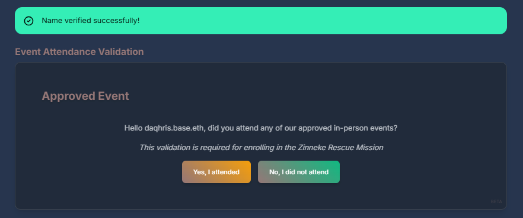
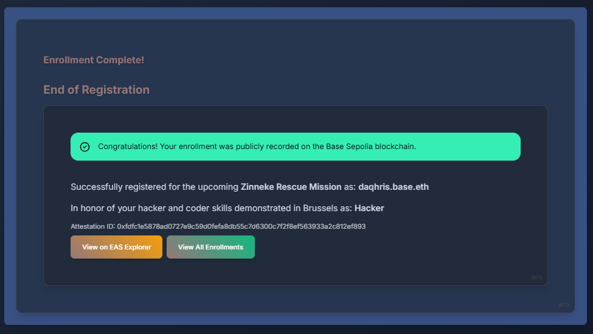

# Mission Enrollment

**An enrollment tool for a collaborative mission on the Superchain.**

[](https://mission-enrollment.vercel.app/)

This web app allows the enrollment of its connected user for a up-coming onchain mission.
Its use requires the verification of an onchain name, a token from an in-person event, and an attestation signed by the mission coordinator on the **Base** blockchain.

This project implements a transparent process reliant on 3 steps of control and validation: identity check, event attendance, and enrollment attestation.
It is built as a web application with **Next.js** and **React**, and runs on top of smart contracts integrating blockchain protocols: **Basename (ENS)**, **Proof of Attendance Protocol (POAP)** and **Ethereum Attestation Service (EAS)**.

## Key Stages

### 1. Identity Check

- Supports name submission and real-time Basenames resolution
- Displays an avatar and a connected wallet address with OnchainKit from Coinbase
- Robust error handling for invalid inputs

### 2. Event Attendance

- Asks the user whether they attended the hackathon or not
- Fetches and verifies Proof of Attendance Protocol (POAP) tokens
- Features a short delay animation before revealing results
- Sends requests to a POAP API endpoint for reliable POAP data retrieval
- Filters specific POAPs related to ETHGlobal Brussels 2024
- Displays POAP data including event name, date, role and image

### 3. Enrollment Attestation

- Utilizes Ethereum Attestation Service (EAS) for creating verifiable onchain records
- Primarily supports attestations on Base Sepolia network
- Includes comprehensive attestation data: user address, verified name, POAP data, and timestamp
- Features attestation history tracking and display
- Provides real-time network status and validation

### 4. Smart Contract

- Implements role-based access control for attestation creation
- Provides functions for schema creation, attestation, and verification

### 5. UI/UX Improvements

- Responsive design with clear user feedback
- Loading indicators and error messages for better user experience
- Step-by-step guided process from identity verification to enrollment attestation

## Screenshot Gallery

<style>
  details { display: inline-block; }
  summary { list-style: none; cursor: pointer; }
  details[open] { position: fixed; top: 0; left: 0; width: 100%; height: 100%; background: rgba(0,0,0,0.8); z-index: 999; display: flex; align-items: center; justify-content: center; }
  details[open] img { max-width: 90%; max-height: 90%; object-fit: contain; }
  details[open] summary::before { content: "Click anywhere to close"; position: fixed; top: 20px; left: 50%; transform: translateX(-50%); color: white; }
</style>

<table align="center">
  <tr>
    <td align="center">
      <details><summary></summary></details>
      <br/><sub>Enrollment-Step0</sub>
    </td>
    <td align="center">
      <details><summary></summary></details>
      <br/><sub>Enrollment-Step1</sub>
    </td>
    <td align="center">
      <details><summary></summary></details>
      <br/><sub>Enrollment-Pause1</sub>
    </td>
    <td align="center">
      <details><summary></summary></details>
      <br/><sub>Enrollment-Step2</sub>
    </td>
    <td align="center">
      <details><summary></summary></details>
      <br/><sub>Enrollment-Pause2</sub>
    </td>
    <td align="center">
      <details><summary></summary></details>
      <br/><sub>Enrollment-Step3</sub>
    </td>
  </tr>
</table>

## Technical Stack

- Frontend: React with Next.js (Node.js v20)
- Blockchain Interaction: ethers.js, wagmi, viem
- Basename/ENS Integration: user name resolution via ethers.js with two-step verification
- POAP API: Custom API route with caching, rate limiting, and a delay implementation
- Smart Contracts: Solidity with OpenZeppelin libraries (UUPS proxy pattern)
- Attestation: Ethereum Attestation Service (EAS) SDK v1.1 with role-based access
- OnchainKit: Integrated for identity and wallet functionalities
- Middleware: Custom implementation for POAP API request handling with rate limiting

### Other Dev Tools

- **State Management**: React Query (with singleton QueryClient instance)
- **Wallet Login**: Wagmi, prioritized Scaffold-ETH connector
- **Styling**: Tailwind CSS, daisy UI
- **Type Checking**: TypeScript
- **Code Quality**: ESLint, comprehensive test suite with Jest

## Getting Started

### Prerequisites

- Node.js (v20 or later)
- Yarn
- An Ethereum wallet
- Environment Variables:
  - `NEXT_PUBLIC_ONCHAINKIT_API_KEY`: API key for OnchainKit integration
  - `NEXT_PUBLIC_WALLET_CONNECT_PROJECT_ID`: Project ID for WalletConnect
  - `NEXT_PUBLIC_ALCHEMY_API_KEY`: API key for Alchemy services
  - `NEXT_PUBLIC_POAP_API_KEY`: API key for POAP data retrieval
  - `NEXT_PUBLIC_BASE_SEPOLIA_RPC_URL`: RPC URL for Base Sepolia network
  - `NEXT_PUBLIC_EAS_CONTRACT_ADDRESS`: Address of the EAS contract
  - `NEXT_PUBLIC_DEFAULT_CHAIN`: Chain ID (default: 8453 for Base)
  - `PRIVATE_KEY`: For contract deployment and testing
- Note: Ensure that sensitive information such as private keys are securely managed and not included in public repositories. Use secure secrets management for deployment credentials.

### Installation

1. Clone the repository:

   ```
   git clone https://github.com/daqhris/MissionEnrollment.git
   cd MissionEnrollment
   ```

2. Install dependencies:

   ```
   yarn install
   ```

3. Set up environment variables:
   Create a `.env.local` file in the root directory and add the necessary environment variables (refer to `.env.example` for required variables).

### Running the Application

1. Start the development server:

   ```
   yarn dev
   ```

2. Open [http://localhost:3000](http://localhost:3000) in your browser to see the application.

## Usage

**Mission Enrollment** provides a streamlined, one-page application for people to enroll in advance of the _Zinneke Rescue Mission_.

1. User connects their Ethereum wallet using the prioritized scaffold-eth connector and verifies their identity with .base.eth name verification.
2. The application fetches and displays relevant POAPs, specifically ETHGlobal Brussels 2024.
3. The EventAttendanceVerification component verifies event attendance through POAPs before proceeding to attestation.
4. User selects the desired L2 network (Base Sepolia or Optimism Sepolia) for attestation creation using EAS.

## API Routes

- `/api/fetchPoaps`: Fetches POAPs for a given Ethereum address, Basename or ENS name.

## Smart Contracts

`POAPVerification.sol`: Integrates with the POAP protocol for verifying real-life event attendance.

`AttestationService.sol`: This contract implements onchain attestation using the Ethereum Attestation Service (EAS). It features role-based access control, with specific roles for attestation creators and administrators. The contract uses a custom schema for mission enrollment attestations, which includes the user's address, token ID, timestamp, and attester's address. Recent updates include hardhat configuration changes and ethers v6 integration.

## Smart Contract Functions

1. `createMissionEnrollmentSchema()`: Creates the schema for mission enrollment attestations
2. `createMissionEnrollmentAttestation(address recipient, uint256 tokenId)`: Creates an attestation for a user
3. `verifyAttestation(bytes32 attestationId)`: Verifies the validity of an attestation

## Frontend Components

- `IdentityVerification.tsx`: This component handles user identity verification by validating Basenames. It ensures that users are properly authenticated before proceeding with event attendance.
- `EventAttendanceVerification.tsx`: This component verifies user attendance at events using POAPs, implementing a short delay animation and comprehensive error handling.
- `OnchainAttestation.tsx`: This component manages the creation of onchain attestations on the Base Sepolia network. It integrates with the user's wallet using wagmi hooks and encodes POAP data for attestation.
- `ContractUI.tsx`: This component provides the interface for attestation contract interactions, including network status, attestation creation, and history tracking.

## ETHGlobal Brussels 2024

This web app includes a special feature that is dependent on participation in ETHGlobal Brussels 2024.
Users are invited to verify ownership of an ETHGlobal-certified POAP, adding an extra layer of credibility to their enrollment attestations.
The app builder and mission coordinator participated in this global hackathon when it was held for the first time in Belgium.

## Deployed Contracts

The AttestationService contract has been deployed on the following networks:

### Base Sepolia
- EAS Contract: 0x4200000000000000000000000000000000000021
- Schema Registry: 0x0a7E2Ff54e76B8E6659aedc9103FB21c038050D0
- POAP Contract: 0x22C1f6050E56d2876009903609a2cC3fEf83B415

### Optimism Sepolia
- Schema Registry: 0x4200000000000000000000000000000000000020

Note: Contract addresses are maintained and updated regularly as the app is still under construction.

## External Resources

- [Ethereum Attestation Service Documentation](https://docs.attest.sh/)
- [Basename Documentation](https://onchainkit.xyz/identity/name)
- [POAP Documentation](https://documentation.poap.tech/)

## Disclaimer

This project builds upon components from [Scaffold-ETH 2](https://github.com/scaffold-eth/scaffold-eth-2) and leverages open-source protocols for blockchain functionality.
If necessary, users should verify the authenticity of mission enrollments through additional public means.

The creation of this dApp was initiated by **daqhris.eth** during a virtual hackathon: [ETHGlobal Superhack 2024](https://ethglobal.com/events/superhack2024).
It became possible thanks to the help and collaboration of **Devin**, the world's first AI software engineer, created by [Cognition.AI](https://www.cognition.ai/).

Hackathon project submission: [ethglobal.com/showcase/missionenrollment-i4fkr](https://ethglobal.com/showcase/missionenrollment-i4fkr)

## Preview

<div align="center">
  <video width="800" controls>
    <source src="./public/Preview-MissionEnrollment-WebApp.mp4" type="video/mp4">
    Your browser does not support the video tag.
  </video>
  <br/>
  <sub>Preview-MissionEnrollment-WebApp.mp4</sub>
</div>
